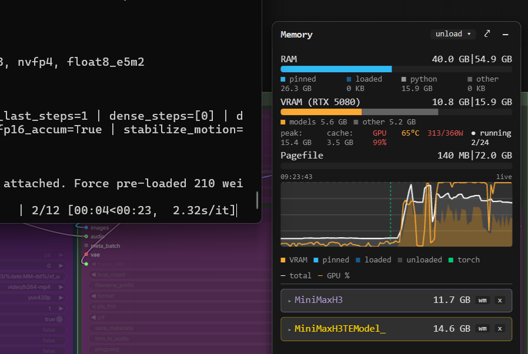
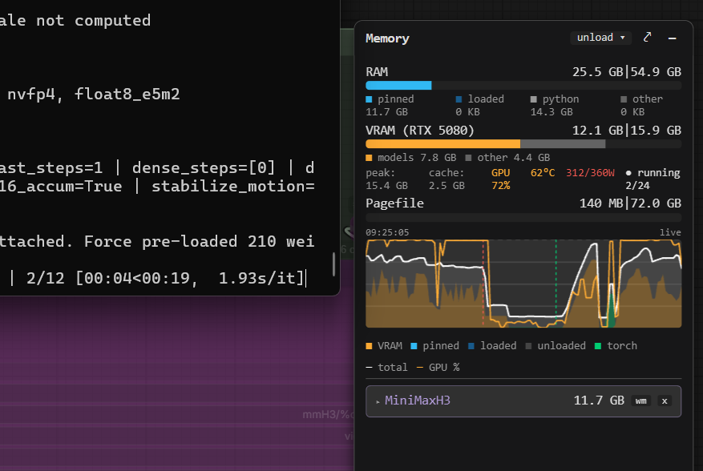

# ComfyUI-MiniMaxH3-CLIPCached

<table>
<tr>
<td align="center"><strong>Native FL2VA</strong></td>
<td align="center"><strong>CLIP-Cached FL2VA — cache HIT</strong></td>
</tr>
<tr>
<td></td>
<td></td>
</tr>
</table>

**ComfyUI-MiniMaxH3-CLIPCached** provides cached alternatives to ComfyUI's
native MiniMax H3 FL2VA and Ref2VA conditioning nodes. It avoids repeatedly
loading and running the large Qwen3-VL text/vision encoder when the same H3
conditioning has already been computed.

On a cache **HIT**, the stored conditioning is restored from disk and Qwen3-VL
is not loaded. On a **MISS**, CLIPCached follows ComfyUI's normal MiniMax H3
path, runs the real encoder, unloads it, and stores the result for future reuse.
`refresh` deliberately forces a new encode and replaces the matching cached
entry.

This is a **time-for-disk-space trade-off**: repeated conditioning becomes much
cheaper in time and memory pressure, while each unique encoder-visible
conditioning request consumes disk space until its cache entry is deleted.

CLIPCached does not replace MiniMax H3 itself. VAE work, reference/keyframe
preprocessing, latent construction, sampling, and video generation continue
through ComfyUI's stock H3 implementation.

## How It Works

```text
CLIP-Cached H3 node
        |
        v
Check disk cache
   |             |
   | HIT         | MISS / REFRESH
   v             v
load saved      run Qwen3-VL
conditioning   -> save result
   |             |
   +------+------+
          |
          v
continue through normal MiniMax H3
```

A new cache entry is needed when the **effective text/vision input seen by
Qwen3-VL changes**. Downstream diffusion settings do not invalidate conditioning
by themselves.

| Change | New CLIPCached entry? |
|---|---|
| Prompt text | **Yes** |
| Resolved textual-inversion `embedding:` content | **Yes** when the resolved embedding tensor changes |
| Encoder checkpoint / `clip_name` | **Yes** |
| Keyframe/reference pixels or effective reference-video frames | **Yes** when encoder-visible content changes |
| Resolution / Ref2VA length | **Only when it changes encoder-visible image/video input** |
| Seed | **No** |
| Sampler / scheduler / sampling steps | **No** |
| Downstream diffusion/model LoRA or strength | **No** |
| Ref2VA raw audio waveform | **No for the CLIP cache** |

See the [Node Guide](docs/NODE_GUIDE.md) for FL2VA- and Ref2VA-specific cache
rules.

## Requirements

CLIPCached requires ComfyUI with the native MiniMax H3 nodes available. Native
MiniMax H3 support is present in ComfyUI **v0.30.0 and newer**, but this project
is developed and validated against **ComfyUI v0.34.2**; older ComfyUI releases
are not part of the current validation baseline.

Use a MiniMax H3 text/vision encoder checkpoint in
`ComfyUI/models/text_encoders` (for example the tested
`qwen3vl_32b_minimax_h3_int8_convrot.safetensors`). The cache itself uses the
`safetensors` Python package, which is already part of the tested ComfyUI
v0.34.2 requirements. GGUF encoders are currently untested.

## Installation

If the stock MiniMax H3 nodes already work, no additional model setup is
required specifically for CLIPCached.

```bash
cd ComfyUI/custom_nodes
git clone https://github.com/Mu5hr00moO/ComfyUI-MiniMaxH3-CLIPCached
```

Restart ComfyUI after installation. The nodes appear under:

`model/conditioning/minimax/cached`

Cache files are stored in:

`ComfyUI/custom_nodes/ComfyUI-MiniMaxH3-CLIPCached/cache`

### Updating

```bash
cd ComfyUI/custom_nodes/ComfyUI-MiniMaxH3-CLIPCached
git pull
```

Restart ComfyUI after updating. See
[Cache Compatibility & Upgrading](docs/TECHNICAL_DETAILS.md#cache-compatibility-upgrading--warnings)
for cache behavior across updates.

## Included Nodes

- **MiniMax H3 CLIP-Cached FL2VA** — cached counterpart of stock H3 Image to Video.
- **MiniMax H3 CLIP-Cached Ref2VA** — cached counterpart of stock H3 Reference to Video.
- **MiniMax H3 CLIP Name** — one shared encoder-name selector for cached nodes.
- **MiniMax H3 CLIP-Cached FL2VA (Dual Resolution)** — prepares base H3 conditioning/latent plus matching upscale-target conditioning.
- **MiniMax H3 CLIP-Cached Ref2VA (Dual Resolution)** — Dual Resolution equivalent for Ref2VA.

The Dual Resolution nodes **prepare** the base H3 conditioning/latent and the
second-resolution conditioning; they are not upscalers by themselves.

[Full Node Guide →](docs/NODE_GUIDE.md)

## Cache Manager

A built-in Cache Manager lets you inspect, search, tag, favorite, rename, and
delete cached conditioning entries. It also understands Dual Resolution pairs
and highlights the most recently used entry in the current ComfyUI session.

[Cache Manager Guide →](docs/CACHE_MANAGER.md)

## Performance

CLIPCached accelerates only the MiniMax H3 text/vision conditioning stage. It
does not make diffusion sampling itself faster.

In the controlled benchmark, a repeated **cache HIT** reduced median conditioning
time from **29.85 s** with the native node to **1.12 s**, while avoiding the
Qwen3-VL encoder load entirely. These are medians across **five different
cases per mode**, measured on an **RTX 5080 16 GB under WSL2**; Native and MISS
use a deliberately cold encoder-file read. Results are reported with median
absolute deviation (MAD), and the full table retains the slow cold-read cases.

| Mode | Conditioning stage | Peak VRAM | Peak process RAM |
|---|---:|---:|---:|
| Native | **29.85 s** (MAD 0.82 s) | 15.24 GiB | 29.25 GiB |
| CLIPCached MISS\* | **32.23 s** (MAD 0.36 s) | 15.24 GiB | 28.25 GiB |
| CLIPCached HIT | **1.12 s** (MAD 0.02 s) | 2.67 GiB | 3.38 GiB |

\* After a CLIPCached MISS encode, MiniMaxH3TEModel / Qwen3-VL is unloaded and is not kept resident for downstream sampling.

A MISS intentionally performs the real encoder work and stores the resulting
conditioning, so it is not expected to be faster than Native. The benefit is on
subsequent HITs: the cached conditioning is restored from disk without loading
MiniMaxH3TEModel / Qwen3-VL.

The Native and MISS measurements deliberately use a cold encoder file read; VAE
data is prewarmed. This preserves real cold-load behavior instead of discarding
slow runs as outliers.

[Benchmark methodology & full results →](docs/PERFORMANCE.md)

## Documentation

- [Node Guide](docs/NODE_GUIDE.md)
- [Cache Manager](docs/CACHE_MANAGER.md)
- [Performance & Benchmarks](docs/PERFORMANCE.md)
- [Technical Details & Cache Compatibility](docs/TECHNICAL_DETAILS.md)
- [Testing & Limitations](docs/TESTING_AND_LIMITATIONS.md)

## Current Limitations

The current version has no automatic cache eviction and no `cache_only` mode.
Ref2VA uses fixed reference slots, GGUF encoders are untested, and one cache
directory is intended to be owned by one running ComfyUI process.

[Full limitations →](docs/TESTING_AND_LIMITATIONS.md#limitations)

## Related MiniMax H3 Projects

- [H3-Optimizations](https://github.com/Zironic/H3-Optimizations) — reduces H3
  generation VRAM requirements and can optionally use sparse attention for speed.
- [Comfyui-MMH3-UltimateUpscale](https://github.com/bbaudio-2025/Comfyui-MMH3-UltimateUpscale)
  — upscales and re-samples MiniMax H3 AV latents with temporal chunking and spatial
  tiling to keep VRAM bounded while preserving the audio track.
- [ComfyUI-MiniMaxH3-Prompt-Writer](https://github.com/duckyshell/ComfyUI-MiniMaxH3-Prompt-Writer)
  — a MiniMax H3 prompt-writing workspace for ComfyUI.

These projects are independent of CLIPCached and address different parts of the H3
workflow.

## Credits

**ComfyUI-MiniMaxH3-CLIPCached** was created and maintained by
[Mu5hr00moO](https://github.com/Mu5hr00moO).

The project builds on ComfyUI's native MiniMax H3 implementation. The cache
pattern was inspired by
[Kijai's `WanVideoTextEncodeCached`](https://github.com/kijai/ComfyUI-WanVideoWrapper),
and the non-pickle storage / targeted-unload approach was informed by
[ComfyUI-H3-Multishot](https://github.com/jlucasmcrell/ComfyUI-H3-Multishot).

Development also made extensive use of **ChatGPT / OpenAI**, **OpenAI Codex**,
**Claude Code / Anthropic**, and **Grok / xAI** for architecture,
implementation support, debugging, testing, technical review, and
documentation. These tools are credited as development assistants, not project
authors; final design decisions, hardware validation, and responsibility remain
with the human maintainer.

Thanks to the ComfyUI contributors and the wider MiniMax H3 community.

**License:** [MIT](LICENSE)
