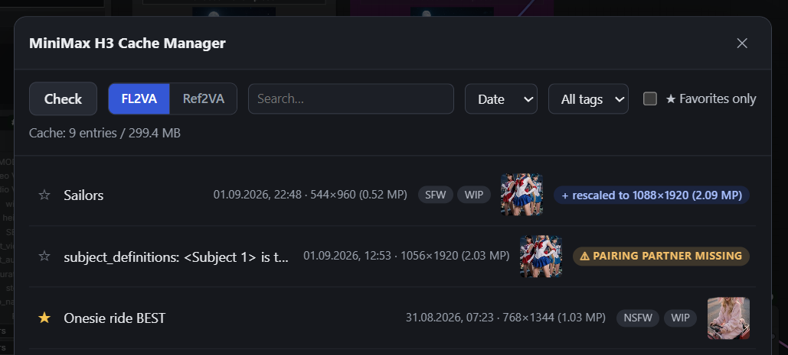
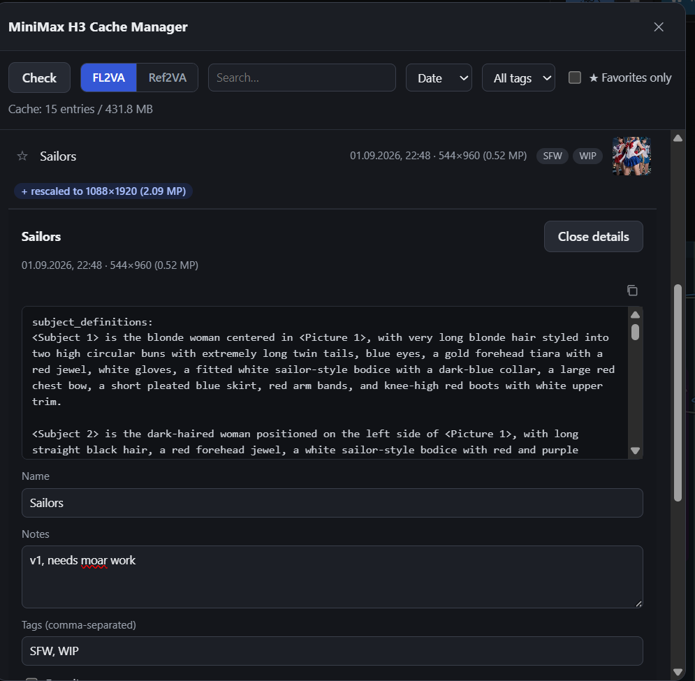

# Cache Manager

CLIPCached includes a built-in **MiniMax H3 Cache Manager** for inspecting,
organizing, and deleting cached conditioning entries without manually browsing
the `cache` directory.

Open it from the floating Cache Manager launcher in ComfyUI or through:

`Extensions -> MiniMax H3 Cache Manager`

## Checking the cache

Press **Check** to scan the cache directory and refresh the list of entries.

The panel shows FL2VA and Ref2VA entries separately. Use the **FL2VA / Ref2VA**
toggle to switch between them.

Normal entries can show information such as:

- custom name,
- prompt,
- creation date,
- generation resolution,
- on-disk size,
- encoder checkpoint,
- reference thumbnails,
- user tags and notes,
- favorite state,
- whether the entry was the most recently used cache for that node type.

Legacy and inconsistent entries show far less, but they do show their size:
these are often the entries worth removing, and deleting them is usually the
only thing to do with them.

The information displayed by Cache Manager is descriptive metadata. Editing a
name, note, tag, or favorite does **not** change the fingerprint and does not
turn an existing cache HIT into a MISS.

## Search, filters, and sorting

The list can be narrowed without changing the cache itself.

**Search** matches the custom name, prompt, notes, and tags.

Additional controls let you:

- filter by tag,
- show favorites only,
- switch between FL2VA and Ref2VA entries,
- sort by **Date** or **Name**.

Date sorting shows the newest normal entries first. Name sorting uses the custom
name when one exists, otherwise the prompt-derived entry label.

## Entry details and organization

Open an entry to inspect its details and references.

User-editable fields include:

- **Name** — a custom label for easier identification,
- **Notes** — free-form notes about the entry,
- **Tags** — comma-separated labels used for organization and filtering,
- **Favorite** — marks frequently used entries.

Reference images are shown as thumbnails when available.

**Copy prompt** copies only the stored prompt string to the clipboard. When the
cached entry contains image references, the panel also shows thumbnails and
positional reference information as a visual reminder of what produced the
entry. It does not preserve the original source filenames or automatically
restore those files into workflow inputs.

These organizational fields belong only to Cache Manager. They are never used
to decide whether CLIPCached returns a HIT or MISS.

## Generation resolution

The resolution shown for an entry (`WIDTH×HEIGHT (N MP)`) is the resolution of
the **most recent run that used the entry**, not necessarily the run that
created it.

When no keyframes (FL2VA) or references (Ref2VA) are connected, the encode is
resolution-independent: `width` and `height` never enter the fingerprint, so a
single cached encode is reused across every generation size. On each cache HIT
at a new resolution, Cache Manager moves this field forward to that resolution;
nothing else about the entry changes, because the cached conditioning itself is
identical.

As a result the creation date and the resolution can come from two different
moments: the date is fixed when the entry is first written, while the resolution
follows whichever run last reused it.

For a Dual Resolution run whose two passes share one fingerprint, the single
entry keeps the **base** resolution rather than the upscale one.

## Entry size

Each entry reports how much disk it occupies. The figure covers exactly the
files that removing that entry deletes: the cached conditioning, its metadata,
and its reference thumbnails.

The header above the list (`Cache: N entries / size`) is a separate figure --
the size of the whole cache directory. It is normally a little larger than the
entry sizes added together, because stray files that belong to no entry still
count toward it.

For a Dual Resolution pair folded into a single row, the size shown is the
**pair total** for both halves and is marked as such on the line. Only the
folded row reports a total; the paired entry inside the expanded
`+ rescaled to` strip reports just its own size. Delete acts on one entry at
a time either way -- see below.

## Last Used

Cache Manager highlights the cache entry most recently used by the corresponding
CLIPCached node during the current ComfyUI session.

This is intended as a quick visual answer to:

> Which cache entry did my workflow just use?

It is not a permanent usage-history or ranking system.

For a valid Dual Resolution pair, the visible base entry is also highlighted
when the most recently used fingerprint belongs to its hidden upscale partner.

## Dual Resolution entries

When a Dual Resolution run produces two different cache entries, Cache Manager
stores their base/upscale relationship and normally presents them as one logical
item.

The base-resolution entry remains visible and receives a:

`+ rescaled to WIDTHxHEIGHT`

indicator for the paired upscale entry. Expanding it reveals the paired
resolution without filling the main list with a second near-identical prompt.

If both resolutions use the same cache fingerprint, only one cache entry exists
and there is nothing to pair.

## Deleting entries and orphaned pairs

Press **Delete** in an entry's detail view to remove that cache entry after
confirmation.

**Delete always acts on one entry.** For a folded Dual Resolution pair that
matters, because the size shown on the row is the pair total: pressing Delete
there frees only this entry's share of it. The paired entry has its own
Delete button inside the expanded `+ rescaled to` strip.

Deleting one side of a Dual Resolution pair does **not** automatically delete
the other side. This is intentional: the remaining conditioning may still be
useful independently.

If its partner is missing or the old relationship is no longer mutual, Cache
Manager treats the remaining entry as an **orphaned pair**. It is shown as a
standalone cache entry with a warning instead of being hidden behind an invalid
pairing.

This also means that re-pairing a base entry with a different upscale resolution
can leave an older upscale entry orphaned. It can simply be kept as a normal
cache entry or deleted if it is no longer needed.

## Clearing the cache manually

The cache files live in:

`ComfyUI/custom_nodes/ComfyUI-MiniMaxH3-CLIPCached/cache`

Individual entries are easiest to remove through Cache Manager, but the cache
directory can also be cleared manually when you deliberately want to discard
all stored conditioning.

Removing cache files is safe from the workflow's point of view: the next time a
missing entry is needed, `cache_mode="auto"` simply produces a MISS and rebuilds
it through the normal Qwen3-VL path.

## Cache Manager example

The populated view shows the manager in normal use with accumulated cache
entries and its search, filtering, sorting, and organization controls.