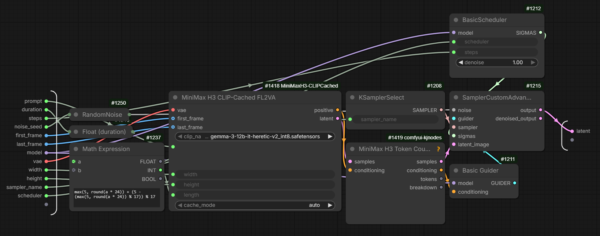
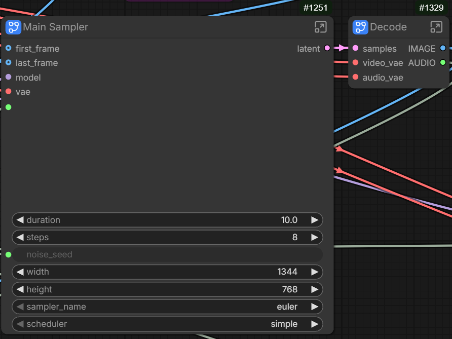
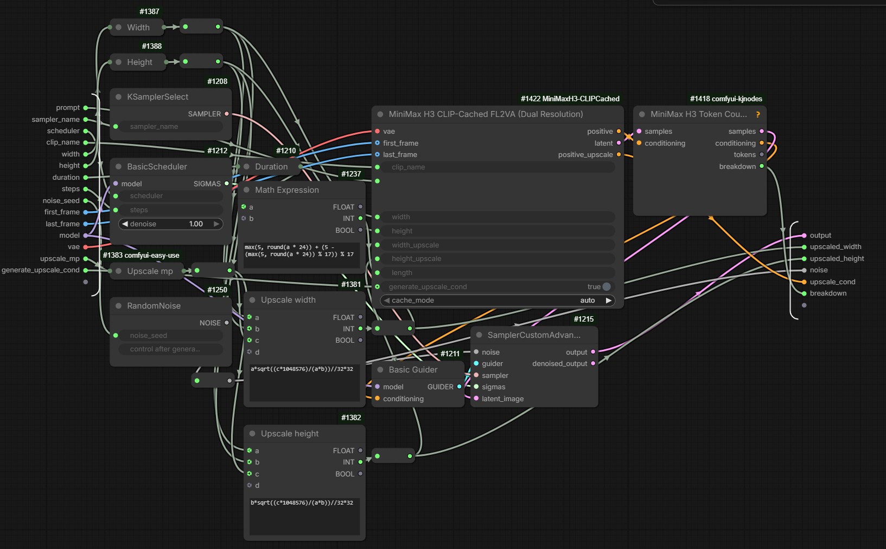
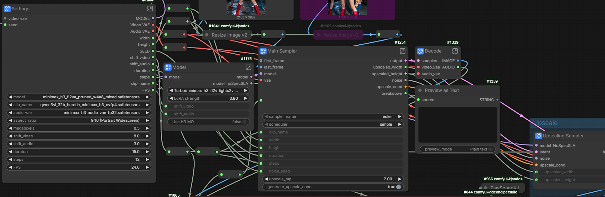

# Node Guide

## Common Behavior of Cached Nodes

All CLIPCached FL2VA and Ref2VA nodes use the same cache controls. The
model-specific inputs are explained in the following sections.

| Input | What it does |
|---|---|
| `clip_name` | Selects the MiniMax H3 text/vision encoder checkpoint. Unlike the stock H3 nodes, you select the checkpoint by name instead of connecting an already-loaded CLIP object. |
| `cache_mode` | `auto` reuses a matching cache entry when possible. `refresh` forces a new Qwen3-VL encode and replaces the matching stored entry. |

### First run and repeated runs

For a new prompt/reference setup, `cache_mode="auto"` normally produces a
**MISS**. The node runs the real Qwen3-VL encode and saves the result.

When the same conditioning is needed again, the node can produce a **HIT** and
load that result from disk instead. The rest of the MiniMax H3 workflow
continues normally.

`cache_mode="refresh"` is useful when you deliberately want to rebuild an
entry. It always requests a real encode even if a matching cached result already
exists.

### What creates a new cache entry — and what does not

The most important rule is simple: **a new CLIPCached entry is needed only when
Qwen3-VL would receive different effective text/vision input.** Changes that
happen later in the diffusion/generation path do not invalidate the cached
conditioning by themselves.

| Change | New CLIPCached entry? |
|---|---|
| Prompt text | **Yes** — different text conditioning. |
| Resolved textual-inversion `embedding:` content | **Yes** when the embedding tensor resolved by the stock tokenizer changes, even if the prompt text and embedding name stay the same. |
| `clip_name` / encoder checkpoint | **Yes** — different text/vision encoder identity. |
| FL2VA `first_frame` / `last_frame` | **Yes when the image content seen by Qwen3-VL changes.** |
| Ref2VA reference images / reference videos / their effective order | **Yes when the encoder-visible content changes.** |
| FL2VA `width` / `height` | **Yes when `first_frame` or `last_frame` is connected.** Stock H3 resizes each connected keyframe to the requested generation canvas before Qwen3-VL tokenization. With no keyframes, `width` / `height` alone do not change the CLIP conditioning. |
| Ref2VA `width` / `height` with `ref_image_size="match"` | **Can create a new entry** when the target pixel area changes the resized reference image presented to Qwen3-VL. |
| Ref2VA `width` / `height` with `ref_image_size="max"` | **No by themselves for reference images.** In stock H3, `max` reference-image sizing is independent of the generation canvas. |
| Ref2VA reference-video target `width` / `height` | **No by themselves for CLIP conditioning.** Reference videos use their own `adapt_canvas(...)` preprocessing; `length` can still change the effective frames. |
| Ref2VA `ref_image_size` | **Can create a new entry** when switching `match` / `max` changes the resized reference pixels. |
| FL2VA `length` | **No for the CLIP cache.** It changes the target latent/timeline, not the Qwen3-VL text/vision input. |
| Ref2VA `length` | **Can create a new entry** when it changes which reference-video frames reach Qwen3-VL. |
| Seed | **No.** |
| Sampler | **No.** |
| Scheduler | **No.** |
| Sampling steps | **No.** |
| Diffusion/model LoRA or LoRA strength | **No**, as long as the LoRA is applied downstream of the text/vision conditioning stage. |
| VAE choice | **No for the CLIP cache.** The resulting latent can still change. |
| Ref2VA raw audio waveform | **No for the CLIP cache.** The resulting AV latent can still change. |

A downstream diffusion/model LoRA change can therefore reuse the same CLIPCached entry. If you also add,
remove, or change a LoRA trigger word in the **prompt**, the prompt change itself
creates a different cache entry.

`cache_mode="refresh"` is the explicit exception: it forces a real Qwen3-VL
encode even when the existing entry would otherwise be a valid HIT.

The node-specific resolution/reference details are explained below for FL2VA
and Ref2VA.

### What is not cached

CLIPCached does not cache the generated video, diffusion sampling, VAE work, or
the final latent. Those parts continue to be handled normally by ComfyUI and
MiniMax H3.

Only the reusable result of the expensive MiniMax H3 text/vision conditioning
stage is stored on disk.

### Output compatibility

The cached nodes return the same kinds of `CONDITIONING` and `LATENT` outputs as
the corresponding stock MiniMax H3 nodes. Existing downstream H3 workflow
nodes can therefore be connected in the normal way.

## MiniMax H3 CLIP-Cached FL2VA

FL2VA is the author's primary development and real-world usage path for this
project. This node is the cached counterpart of ComfyUI's stock **MiniMax H3
Image to Video** node and is intended to fit into the same kind of workflow.

The main visible difference is the encoder input. Instead of connecting an
already-loaded `clip` object, you select the MiniMax H3 text/vision encoder with
`clip_name`. The encoder is then only loaded when CLIPCached actually needs a
new encode.

| Input | Purpose |
|---|---|
| `clip_name` | Selects the MiniMax H3 text/vision encoder checkpoint used for conditioning. |
| `vae` | Same VAE input as the stock node. VAE processing is not part of the CLIP cache and still runs normally. |
| `prompt` | The MiniMax H3 prompt. Changing it normally requires a new cached conditioning result. |
| `width` / `height` | Target generation resolution, with the same role as in the stock node. |
| `length` | Target video length/frame count, handled normally by the stock H3 path. |
| `first_frame` | Optional starting keyframe, same purpose as in the stock node. |
| `last_frame` | Optional ending keyframe, same purpose as in the stock node. |
| `cache_mode` | `auto` reuses a valid entry when possible; `refresh` forces a new encode. |

### Cache behavior in FL2VA

For FL2VA, the practical rule is:

**Normally creates a new cache entry:**

- changing the prompt,
- changing the resolved contents of a textual-inversion `embedding:` used by the prompt,
- changing `clip_name` / the encoder checkpoint,
- changing the content of `first_frame` or `last_frame`,
- changing `width` / `height` when `first_frame` or `last_frame` is connected.
  Stock H3 resizes connected keyframes to the requested generation canvas
  before Qwen3-VL tokenization, so a different canvas produces a different
  encoder-visible image tensor.

**Does not by itself create a new CLIPCached entry:**

- seed,
- sampler,
- scheduler,
- sampling steps,
- diffusion/model LoRA or LoRA strength,
- `length` alone — it changes the FL2VA target latent/timeline, not the Qwen3-VL input,
- VAE changes — although they can still change the returned latent.

Generation resolution is deterministic for FL2VA keyframes. With `first_frame`
or `last_frame` connected, stock ComfyUI resizes the connected image to the
requested `width` / `height` before passing it to Qwen3-VL. Changing either
dimension therefore requires different CLIP conditioning. If no keyframes are
present, `width` / `height` affect the target latent but do not change the
Qwen3-VL input, so the same cached text conditioning can be reused.

As everywhere else in CLIPCached, the decision follows the **effective encoder
input**, not the fact that a widget value changed.

### Outputs and workflow use

The node returns:

- `positive` — standard MiniMax H3 `CONDITIONING`,
- `latent` — standard MiniMax H3 `LATENT`.

They can be connected to the same downstream MiniMax H3 nodes used with the
stock FL2VA node. CLIPCached does not change the generated-video path; it only
changes whether the expensive Qwen3-VL conditioning encode has to be repeated.

For a normal FL2VA workflow, the practical replacement is therefore simple:
use **MiniMax H3 CLIP-Cached FL2VA** in place of the stock conditioning node,
select the encoder with `clip_name`, and leave `cache_mode="auto"` for normal
use.

The cached node feeds the same downstream MiniMax H3 generation path as the
stock conditioning node. Only the expensive text/vision conditioning stage is
reused on a cache HIT.

## MiniMax H3 CLIP-Cached Ref2VA

> **Author's note:** Development and real-world testing of this project has
> focused primarily on the FL2VA path. The Ref2VA node follows the same cache
> architecture and delegates its MiniMax H3 behavior to ComfyUI's stock Ref2VA
> implementation, but it has not received the same depth of empirical workflow
> testing as FL2VA. Ref2VA users should therefore treat it as less
> battle-tested and report any workflow-specific issues they encounter.

**MiniMax H3 CLIP-Cached Ref2VA** is the cached counterpart of ComfyUI's stock
MiniMax H3 Reference to Video node. Use it when the generation is conditioned by
one or more reference images, reference videos, or reference audio sources.

As with FL2VA, the actual MiniMax H3 reference processing remains in ComfyUI's
stock node. CLIPCached replaces the stock `clip` connection with `clip_name` and
reuses the Qwen3-VL text/vision conditioning when the encoder sees the same
effective inputs again.

| Input | What it does |
|---|---|
| `clip_name` | Selects the MiniMax H3 text/vision encoder checkpoint. |
| `vae` | Same VAE input used by the stock Ref2VA node. VAE work is not stored in the CLIP cache. |
| `audio_vae` | Same audio VAE input used by the stock Ref2VA path for audio/AV processing. |
| `prompt` | MiniMax H3 prompt. Changing it requires different text/vision conditioning. |
| `width` / `height` | Target generation resolution. These can indirectly affect the cache when they change how reference images are prepared for the encoder. |
| `length` | Output frame count. It can indirectly affect the cache when it changes which frames from a reference video reach Qwen3-VL. |
| `ref_image_size` | `match` sizes reference images toward the generation pixel area; `max` keeps the reference pipeline's larger 2048px-short-edge path for maximum identity detail. |
| `ref_image_0`–`ref_image_8` | Up to 9 optional reference images. |
| `ref_video_0`–`ref_video_2` | Up to 3 optional reference videos, supplied as `IMAGE` batches of frames. |
| `ref_video_audio_0`–`ref_video_audio_2` | Optional soundtrack paired with the same-numbered reference video. |
| `ref_audio_0`–`ref_audio_2` | Up to 3 optional standalone reference audios. |
| `cache_mode` | `auto` reuses a matching entry when possible; `refresh` forces a new Qwen3-VL encode. |

### Quick cache guide for Ref2VA

**Normally creates a new cache entry:**

- changing the prompt,
- changing `clip_name` / the encoder checkpoint,
- changing reference-image pixels,
- changing the reference-video frames seen by Qwen3-VL,
- changing the effective order/number of image, video, or audio references,
- changing `width` / `height` or `ref_image_size` when that changes the resized
  reference pixels presented to Qwen3-VL,
- changing `length` when it changes which reference-video frames reach the
  encoder.

**Does not by itself create a new CLIPCached entry:**

- seed,
- sampler,
- scheduler,
- sampling steps,
- diffusion/model LoRA or LoRA strength,
- changing only the raw audio waveform,
- changing `vae` / `audio_vae` — although the resulting latent/AV latent can
  still change.

The important distinction is again what **Qwen3-VL actually sees**. A numeric
resolution or length change is only a cache change when it produces different
encoder-visible image/video input.

### Reference slot ordering

The stock Ref2VA node uses dynamic reference lists. The 
current CLIPCached Ref2VA node
exposes a fixed set of optional slots instead: 9 image slots, 3 video slots,
3 matching video-soundtrack slots, and 3 standalone audio slots.

Only connected slots are passed onward. Gaps are compacted while preserving
slot order. For example, if only `ref_image_0` and `ref_image_4` are connected,
they become the first and second image references seen by stock Ref2VA — they
are not treated as "Picture 1" and "Picture 5".

This matters because MiniMax H3 prompt references such as `<Picture 1>`,
`<Picture 2>`, `<Video 1>`, and so on refer to the resulting positional order,
not to the numeric suffix of the CLIPCached input socket.

### What changes the Ref2VA cache

Reference **image pixels** and the **video frames presented to Qwen3-VL** are
part of the text/vision conditioning. If those effective inputs change, a
different cache entry is expected.

For reference **images**, the resolution rule depends on `ref_image_size`:

- with `ref_image_size="match"`, stock H3 scales the reference down according
  to the generation pixel area (`width * height`), so changing generation
  resolution can change the pixels presented to Qwen3-VL and therefore create
  a new cache entry;
- with `ref_image_size="max"`, stock H3 sizes the reference from the reference
  image itself (up to the 2048-pixel short-edge limit), independently of the
  generation `width` / `height`. Changing only the generation resolution does
  not therefore create a new CLIP entry for that reference image;
- switching between `match` and `max` creates a new entry only when the two
  modes actually produce different resized pixels. A small image that neither
  mode resizes can still reuse the same conditioning.

Reference **videos** use their own stock `adapt_canvas(...)` preprocessing based
on the reference video's dimensions, not the target generation `width` /
`height`. Their cache identity can still change with `length` because stock
Ref2VA trims/subsamples the effective video frames before Qwen3-VL.

The `max` image mode is stock MiniMax H3 behavior intended to preserve more
reference detail. Because it can create substantially more reference tokens,
it can also make the downstream H3 generation slower.

### Reference video length

`length` is not blindly used as part of the cache identity. What matters is the
actual reference-video frames that reach the text/vision encoder.

Stock Ref2VA trims a reference video to the requested generation length before
subsampling it for Qwen3-VL. This means:

- if the reference video is already shorter than the relevant cut point,
  changing `length` can still reuse the same cached conditioning;
- if changing `length` changes the frames presented to Qwen3-VL, the cache
  correctly produces a MISS.

The generated latent can still change with `length` even when the text/vision
conditioning itself is a cache HIT.

### Audio and the cache

Raw reference-audio waveforms are **not part of the CLIPCached text/vision
entry**. This applies both to standalone `ref_audio_*` inputs and to
`ref_video_audio_*` soundtracks.

Changing only the audio can therefore reuse the same Qwen3-VL cache entry.
The audio is still processed normally by ComfyUI's stock Ref2VA path and can
change the resulting AV latent; it simply does not require Qwen3-VL to repeat
the same text/vision encode.

### Outputs

The node returns:

- `positive` — standard MiniMax H3 `CONDITIONING`,
- `latent` — standard MiniMax H3 `LATENT`.

They can be connected to the same downstream workflow nodes as the outputs from
the stock Ref2VA node.
## MiniMax H3 CLIP Name

**MiniMax H3 CLIP Name** is a small helper node for workflows that use more
than one CLIPCached H3 node. It provides the same MiniMax H3 encoder-checkpoint
dropdown as the cached FL2VA and Ref2VA nodes and outputs the selected
checkpoint name so it can be shared between them.

It does **not** load Qwen3-VL, generate conditioning, or create a cache entry.
It only passes the selected `clip_name` value to other nodes.

### Why use it

In a larger workflow, several cached nodes may need to use the same encoder.
Instead of selecting the checkpoint separately on every node, you can select it
once with **MiniMax H3 CLIP Name** and connect that output to all of them.

This makes the workflow easier to maintain and avoids accidentally leaving one
cached node on a different encoder checkpoint.

### How to connect it

On a cached H3 node, convert the `clip_name` widget to an input using ComfyUI's
**Convert widget to input** action, then connect the output from **MiniMax H3
CLIP Name**.

The helper can be shared by:

- CLIP-Cached FL2VA,
- CLIP-Cached Ref2VA,
- FL2VA Dual Resolution,
- Ref2VA Dual Resolution.

The output is a checkpoint-name selector for this node pack's `clip_name`
inputs. It is **not** a loaded `CLIP` model and does not replace ComfyUI's CLIP
loader nodes.

## Dual Resolution Nodes

The two Dual Resolution nodes are intended primarily for workflows that generate
at one resolution and then continue through a **latent-upscale path** at a
second resolution.

They prepare the MiniMax H3 inputs needed by both branches from one shared set
of inputs:

- base `CONDITIONING` plus base `LATENT` for `width` / `height`,
- upscale-target `CONDITIONING` for `width_upscale` / `height_upscale`.

The upscale branch reuses the base latent through a separate latent-upscale node;
Dual Resolution does not expose a second latent output.

This keeps the prompt, encoder selection, references, length, and other H3 inputs
in one place instead of duplicating a complete cached conditioning node for the
upscale branch.

> **Dual Resolution is not an upscaler.** It does not upscale the generated
> video or perform latent resizing by itself. It prepares base conditioning/latent
> plus matching upscale-resolution conditioning; a separate latent-upscale node
> resizes the base latent for the upscale branch.

Two variants are provided:

- **MiniMax H3 CLIP-Cached FL2VA (Dual Resolution)** — the Dual Resolution
  version of CLIP-Cached FL2VA,
- **MiniMax H3 CLIP-Cached Ref2VA (Dual Resolution)** — the same idea applied
  to CLIP-Cached Ref2VA.

Each variant keeps the normal inputs of its single-resolution counterpart and
adds the second target resolution plus `generate_upscale_cond`.

### Additional inputs

| Input | What it does |
|---|---|
| `width_upscale` / `height_upscale` | Target dimensions used to prepare the second-resolution conditioning. |
| `generate_upscale_cond` | Enables or disables the complete upscale-resolution pass. Default: `True`. |

### Outputs

Both Dual Resolution nodes return three outputs:

| Output | Purpose |
|---|---|
| `positive` | MiniMax H3 `CONDITIONING` for the base `width` / `height`. |
| `latent` | MiniMax H3 `LATENT` for the base `width` / `height`. |
| `positive_upscale` | MiniMax H3 `CONDITIONING` prepared for `width_upscale` / `height_upscale`. |

The former second `LATENT` output (`latent_upscale`) was removed because the
intended latent-upscale workflow takes the base `latent`, resizes it through a
separate latent-upscale node, and combines that resized latent with
`positive_upscale`. The upscale-resolution pass still executes the stock H3
conditioning path and creates its own AV latent internally; that latent is
discarded rather than exposed on a socket. Therefore
`generate_upscale_cond=True` can still pay the stock VAE/latent-preparation cost
for the upscale canvas in addition to the second conditioning pass.

### How caching behaves across the two resolutions

The node runs the normal CLIPCached conditioning path once for each active
resolution. Each pass makes its own HIT/MISS decision based on what Qwen3-VL
would actually see.

With `cache_mode="auto"`:

- if both resolutions produce the same effective encoder input, they resolve to
  the same cache entry. If a real encode is needed, the first pass creates it
  and the second pass can immediately reuse it, so Qwen3-VL is loaded at most
  once for that run;
- if the resolution changes encoder-visible reference pixels or other
  conditioning input, the two passes produce different cache entries. Each
  entry is then reused independently on later runs;
- if either entry already exists, that individual pass can be a HIT even when
  the other pass is a MISS.

This is especially relevant for FL2VA keyframes and Ref2VA reference images,
where changing resolution can change the image that reaches the text/vision
encoder. If the encoder-visible content does not change, CLIPCached deliberately
reuses the same entry instead of creating a duplicate just because the numeric
resolution is different.

With `cache_mode="refresh"`, both active resolution passes are deliberately
re-encoded in full. This applies even when both passes would otherwise resolve
to the same cache entry, so `refresh` can load and run Qwen3-VL twice.

### `generate_upscale_cond`

`generate_upscale_cond` is **enabled by default**.

When it is disabled, the second resolution pass is skipped completely:

- `positive_upscale` returns `None`,
- no upscale-resolution cache lookup or encode is performed,
- no Dual Resolution cache pairing is created for that run.

Use this when you want to keep the Dual Resolution node in the workflow but are
currently generating only the base-resolution branch.

Simply bypassing or disconnecting the downstream upscale consumer does **not**
skip the second pass by itself. The Dual Resolution node is one ComfyUI node
that produces all three outputs together; `generate_upscale_cond=False` is the
control that explicitly prevents the upscale-resolution work.

### Cache Manager pairing

When the two resolutions produce two different cache entries during the same
Dual Resolution run, CLIPCached records them as a base/upscale pair for the
Cache Manager. The UI can then present the upscale entry together with its base
entry instead of showing two unrelated-looking rows with the same prompt.

If both resolutions resolve to the same cache entry, there is nothing to pair.
Likewise, no pair is created when `generate_upscale_cond=False` because the
second pass does not exist.

### Dual Resolution example

The workflow above shows the intended separation of responsibilities: the Dual
Resolution node prepares `positive`, `latent`, and `positive_upscale`; the base
`latent` is resized by a separate latent-upscale node before the upscale branch
uses `positive_upscale`.

